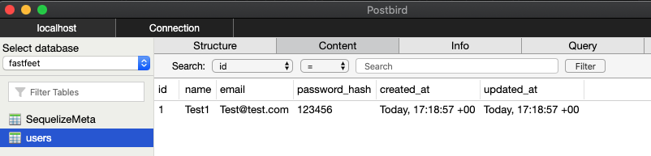

# DB Info:
Thiss folder is used to keep DB related files.

- ***Migrations***: you can use migrations to keep track of changes to the database.
- ***Seeds***: insert some data into a few tables by default.
- ***index.js***: Create the connection with the DB and loads the models

The configuration file, which contains the login and address (localhost and port) to the DB is stored in the [config](../config/database.js) folder.
**The config file tells CLI how to connect with database**

## Concepts

We will be using **SEQUELIZE**, which is an *ORM* for our application.

***What is an ORM?***
It stands for **Object-Relational-Mapper**. Is an abstraction from the DB which allow us to interact with our database using our language of choice instead of SQL. [Check this post](https://blog.bitsrc.io/what-is-an-orm-and-why-you-should-use-it-b2b6f75f5e2a)

Our tables will become models, files that will represent the DB tables in our application.

```sql
INSERT INTO users (name, email)
  VALUES (
    "Name Lastname",
    "email@email.com"
  )
```
```Javascript
  User.create({
      name: 'Name LastName',
      email: 'email@email.com'
  })
```

Sweet! :scream::boom:

More than that, we will use ***Migrations***.<br>
They are a *version control* to our DB. It has instructions to create, update or remove tables or columns.

And ***Seeds***. <br>
This concept/files can be used to populate our DB with sample data. It is mostly used for testing, as they should not be taken to the productive system, if it is necessary to send this data to the *prod* system you should use the *migrations*.

# DB Steps:
0. (create the DB on docker)

1. Create the **credentials** files config > **`database.js`**

1. Create the **`.sequelizerc`** file to export an object with the **path** to our DB files:

1. Create the **migration**, where you will be able to **model** your table (one table per migration).
    - Create a default migration file with this `sequelize-cli` command:

          $ yarn sequelize migration:create --name=create-users

    - Here you can model it accordingly. Use sequelize types (I.e.: type: Sequelize.INTEGER)

1. Run the migration(s):

        $ yarn sequelize db:migrate

      > Here this documentation might come in handy:
      > https://sequelize.org/master/manual/migrations.html

    >*Lesson Learned:* I had another postgres DB running in *port 5432* so I used *port 5433* for this application. This has to be observed:

    >Sequelize will use the default connection port for each dialect (for example, for postgres, it is port 5432). If you need to specify a different port, use the "port" field (it is not present by default in **config/database.js** but you can simply add it).

1. Create the models

    Models are the essence of Sequelize. A model is an **`abstraction that represents a table in your database`**.
    In Sequelize, it is a class that extends [Model](https://sequelize.org/master/class/lib/model.js~Model.html).

1. Create file **`index.js`**
    - This will create the connection with the DB *using sequelize* and ***loads all the models*** of the application passing the `connection` to the models `init()`.

1. Call the `index.js` in `app.js` file.

    - This can be done by importing the DB folder. The `index.js` will be called automatically. (`import './database';`)

    - **NOW!**:

      - You have the DB running on docker.
      - You have **`config/database.js`** with your credentials to connect to that DB.
      - You have **`.sequelizerc`** with the path to each relevant folder/file sequelize will use.
      - You created your migration, ran it, and have your table in the DB.
      - You have your model which will be used to add entries to that table.

    The database *should* be working. And we can make a quick test:

    ```javascript
      // Remember to import this:
      import User from './app/models/User';

      //Create a route calling your model.
      routes.get('/', async (req, res) => {
        await User.create({
          name: 'Test1',
          email: 'Test@test.com',
          password_hash: '123456',
        });

        return res.json({ message: 'A user might have been created' });
      });
    ```
    If everything is as expected. This should have created your very first user when calling the url. :tada:


    

    

1. Now we can create the **CONTROLLER** for our user. <br>

    The controller will be called by a route and receive the information for the user (usually from `req.body`, but also can be done by React or React Native).

     The controller, in this application at this point, can create an user based on the data coming directly from `req.body` as the User's **model** already defined which fields are acceptable, and if any other data is passed, it won't be used.

    The controller will later on validate the information passed. But so far it is only a class, with a function that will receive the information from `req.body` and  call the **MODEL**, which is the responsible to convert our code into SQL to communicate with the DB, and create (or not) a new entry.

    ***Example:*** <br>
    Routes file:
    ```javascript
    //Always remember to import stuff:
    import UserController from './app/controllers/UserController';
    //Create a simple route like this
    routes.post('/users', UserController.store);
    ```
    You controller file can be something as simple as this:
    ```javascript
    import User from '../models/User';

    class UserController {
      // This method will receive the data req.body
      // Call the User.create()
      // Remember that User extends Model. That is why we have a create()
      // Which we did not explicitly defined.
      async store(req, res) {
        const user = await User.create(req.body);

        return res.json(user);
      }
    }
    ```
:boom: :exclamation:

---

<br>  <br>

***"The past can hurt. But the way I see it, you can either run from it or learn from it."*** \

- This property: **`timestamp: true`** will update columns *created_at* and *updated_at* in every DB table.

  This is defined in the DB config **[file](../config/database.js)**
But this columns are no automatically created/added to the tables. Remember to add those in the migration. :man_facepalming:
