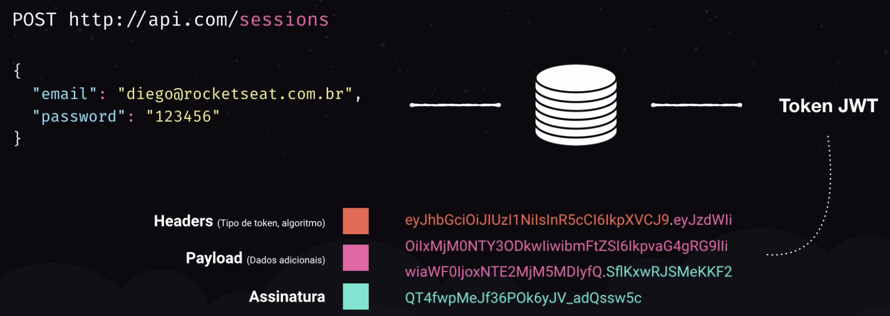
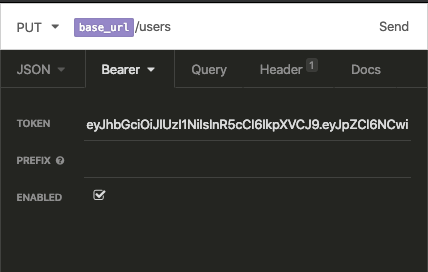

# Security

## Password Hash

The password in the DB will be stored as a hash.
To create and validate this hash we will use the dependency: **`Bcryptjs`**.

The *password* provided by the client will be handled by a virtual field (never stored in the DB)

      password: Sequelize.VIRTUAL, // Receive the typed password
      password_hash: Sequelize.STRING, // Receive the hash and is stored

This password will then be handled by a ***sequelize hook*** `beforeSave`, that will call bcryptjs **`hash()`** function.

  >>When defining the hash, the second parameter is the number of encryption rounds, a.k.a: 'strength' of the hash. Keep in mind how onerous that process can become if your choose to use too many rounds.

```javascript
    this.addHook('beforeSave', async (user) => {
      if (user.password) {
        user.password_hash = await bcrypt.hash(user.password, 8);
      }
    });
```
:alien:

## Authentication

We will use the **JWT** concept, which stands for Jason Web Token.

- We create a route tha will receive the user/password.
- This information is checked in the DB
- If everything is correct, the session token is created.



- The token is encrypted
- The red item is the *header*. It contains the type of token created, and basically is used to inform which type of encryption algorithm was used, so we can manipulate this session, if necessary, in the future.
- The pink item is the *payload*. It contains non sensitive information from the user, like the user id, name, email, in case we need to use it.
- The green item is the token signature. This is used to avoid external manipulation of the token. I.e: if you change the user ID in the payload, the signature will not match the content.

The JWT requires an unique key (secret) to generate the encrypted token.
For that we can use: [MD5 Online](https://www.md5online.org/)

The generated token will be sent in the request header.
This can be done/tested by adding a **`bearer`** token in [insomnia client](https://insomnia.rest/).



